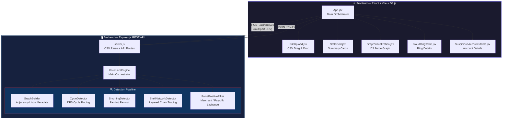

<p align="center">
  
  
  
  
  
</p>

<h1 align="center">🔬 Forensiq Engine</h1>

<p align="center">
  <strong>Codename: Obsidian Trace</strong><br/>
  A precision-built intelligence layer that cuts through complex financial networks, exposing hidden money flows with surgical accuracy.
</p>

<p align="center">
  Upload a CSV of transactions → Engine builds a directed graph → Runs 3 parallel detection algorithms → Filters false positives → Renders an interactive D3.js force-directed network visualization.
</p>

---

## 🎯 What It Does

The Forensiq Engine ingests raw transaction data and automatically identifies **three classes of financial fraud**:

| Pattern | What It Catches | Real-World Example |
|---|---|---|
| 🔄 **Circular Fund Routing** | Money cycling back to its origin through 3–5 accounts | A → B → C → A (layering loop) |
| 🕸️ **Smurfing (Fan-in / Fan-out)** | 10+ accounts funneling into one aggregator, or one account dispersing to 10+ receivers within 72h | Structuring deposits below $10K reporting thresholds |
| 🐚 **Layered Shell Networks** | Chains of 3+ hops through intermediate accounts with only 2–3 total transactions | O1 → SH1 → SH2 → SH3 → E1 (shell layering) |

---

## 🏗️ Architecture



---

## 🔍 Detection Algorithms — Deep Dive

### 1. 🔄 Cycle Detector (`cycleDetector.js`)

Finds **circular fund routing** — money that loops back to its origin through 3–5 intermediate accounts.

```
A ──$10K──▸ B ──$9.8K──▸ C ──$9.5K──▸ A
     ▲                                  │
     └──────────── cycle ◀──────────────┘
```

**Algorithm**: Johnson's algorithm variant using bounded DFS with backtracking.

| Parameter | Value | Why |
|---|---|---|
| `MIN_CYCLE` | 3 | Minimum meaningful cycle |
| `MAX_CYCLE` | 5 | Longer cycles are too common in normal commerce |
| `MAX_OUT_DEGREE` | 30 | Skip high-degree hub nodes (exchanges, merchants) |
| `MAX_RESULTS` | 500 | Performance cap |

**Scoring** (0–100):
- Base: **50** (being a cycle is inherently suspicious)
- Cycle length: **+15** (length 3) → **+5** (length 5)
- Amount similarity: **+15** (CV < 0.1) → low variance = structuring
- Temporal proximity: **+15** (< 24h) → rapid cycling
- Low-activity nodes: **+10** if >50% of cycle nodes have ≤5 total txns

---

### 2. 🕸️ Smurfing Detector (`smurfingDetector.js`)

Detects **structuring** patterns where money is split or aggregated to avoid reporting thresholds.

```
Fan-In:                          Fan-Out:
S1 ──$9K──▸                      ┌──$9K──▸ R1
S2 ──$9K──▸  AGGREGATOR          │──$9K──▸ R2
S3 ──$9K──▸                DISPERSER──$9K──▸ R3
...          (10+ senders)       │         (10+ receivers)
S10──$9K──▸                      └──$9K──▸ R10
```

**Key rules**:
- **Fan-in**: ≥10 unique senders → 1 receiver
- **Fan-out**: 1 sender → ≥10 unique receivers
- **Combined**: Same node receives from ≥10 AND sends to ≥10
- **72-hour temporal window**: Sliding window clusters transactions; only counterparties within the same 72h window count toward the threshold

**Scoring** (0–100):
- Temporal cluster base: **55**
- Counterparty count: **+15** (≥20) / **+10** (≥15) / **+5** (≥10)
- Structuring signal: **+15** if >30% of amounts fall in $8K–$10K range
- Amount uniformity: **+10** if coefficient of variation < 0.2
- Throughput ratio: **+10** if node passes through ~100% of received funds

---

### 3. 🐚 Shell Network Detector (`shellDetector.js`)

Traces **layered shell chains** — money hopping through 3+ intermediate accounts that exist solely as pass-throughs.

```
Exact Pass-Through:
O1 ──$200K──▸ SH1 ──$200K──▸ SH2 ──$200K──▸ SH3 ──$200K──▸ E1

Gradual Decay (fee-skimming):
O1 ──$200K──▸ SH1 ──$198K──▸ SH2 ──$195K──▸ SH3 ──$190K──▸ E1

Shell account criteria: ≤3 total transactions, inDegree ≥1, outDegree ≥1
```

**Key rules**:
- **Minimum 3 hops** (4+ nodes in the chain)
- **Maximum 7 nodes** per chain
- **Amount coherence**: Drop between consecutive hops must be ≤ $10,000
- **Amount cannot increase**: Next hop ≤ previous hop (money doesn't appear from nothing)

**Amount Pattern Classification**:

| Pattern | Condition | Score Bonus |
|---|---|---|
| `exact_passthrough` | All hop amounts within 1% | +15 |
| `gradual_decay` | ≥50% of hops show 1–20% decrease | +20 |
| `mixed` | Coherent but no clear pattern | +10 |

**Scoring** (0–100):
- Base: **45**
- Chain length: **+20** (≥6 nodes) → **+5** (4 nodes)
- Amount pattern: **+15** to **+20** (see table above)
- Temporal sequence: **+15** (all hops within 24h)
- Very low activity shells: **+10** if >50% of intermediates have exactly 2 txns

---

### 4. 🛡️ False Positive Filter (`falsePositiveFilter.js`)

Removes **legitimate high-volume accounts** that would otherwise trigger detection:

| Legitimate Type | Detection Criteria |
|---|---|
| 🏪 **Merchants** | ≥15 unique senders, ≤5 unique receivers, <20% sender-receiver overlap, high amount variance |
| 💼 **Payroll** | ≥10 unique receivers, ≤5 unique senders, regular amounts, temporal regularity or repeat payments |
| 🏦 **Exchanges** | ≥20 unique senders AND ≥20 unique receivers, <15% sender-receiver overlap |
| 👥 **Counterparties** | Low-activity accounts (≤5 txns) that mainly interact with legitimate hubs |

The filter also drops entire fraud rings if they're organized around a legitimate hub.

---

## 📊 Data Flow Pipeline

```mermaid
sequenceDiagram
    participant U as 📤 User
    participant F as ⚛️ Frontend
    participant S as 🖥️ Server
    participant E as 🔬 Engine

    U->>F: Upload CSV
    F->>S: POST /api/analyze (multipart)
    S->>S: Parse CSV → Validate rows
    S->>E: new ForensicsEngine(transactions)
    
    rect rgb(15, 52, 96)
        Note over E: Detection Pipeline
        E->>E: 1. GraphBuilder → adjacency lists + metadata
        E->>E: 2. CycleDetector → circular routes
        E->>E: 3. SmurfingDetector → fan-in/fan-out
        E->>E: 4. ShellNetworkDetector → layered chains
        E->>E: 5. FalsePositiveFilter → remove legit accounts
        E->>E: 6. Merge overlapping rings
    end

    E-->>S: Results JSON
    S-->>F: { suspicious_accounts, fraud_rings, graph_data, summary }
    F->>F: Render D3 force graph + tables
    F-->>U: Interactive visualization
```



---

## 🚀 Quick Start

### Prerequisites

- **Node.js** ≥ 18
- **npm** ≥ 9

### Installation

```bash
# Clone the repository
git clone <repo-url>
cd PW-hack

# Install backend dependencies
cd backend
npm install

# Install frontend dependencies
cd ../frontend
npm install
```

### Running

```bash
# Terminal 1 — Start the backend (port 3001)
cd backend
npm start

# Terminal 2 — Start the frontend (port 5173)
cd frontend
npm run dev
```

Open **http://localhost:5173** in your browser.

---

## 📋 CSV Format

The engine accepts CSV files with the following columns:

| Column | Required | Aliases Supported |
|---|---|---|
| `transaction_id` | ✅ | `transactionid`, `txn_id`, `id` |
| `sender_id` | ✅ | `senderid`, `sender`, `from_id` |
| `receiver_id` | ✅ | `receiverid`, `receiver`, `to_id` |
| `amount` | ✅ | — |
| `timestamp` | ✅ | `datetime`, `date`, `time` |

**Example:**

```csv
transaction_id,sender_id,receiver_id,amount,timestamp
T001,ACC_A,ACC_B,50000,2026-01-15 08:30:00
T002,ACC_B,ACC_C,49500,2026-01-15 09:15:00
T003,ACC_C,ACC_A,49000,2026-01-15 10:00:00
```

**Validation rules:**
- Rows with missing fields are skipped (with warnings)
- Self-transfers (`sender = receiver`) are rejected
- Amounts must be positive numbers
- Timestamps must be parseable by `Date.parse()`
- Max file size: **50 MB**

---

## 🌐 API Reference

| Method | Endpoint | Description |
|---|---|---|
| `POST` | `/api/analyze` | Upload CSV and run full analysis |
| `GET` | `/api/results/:sessionId` | Retrieve stored results |
| `GET` | `/api/download/:sessionId` | Download JSON report |
| `GET` | `/api/health` | Health check |

### `POST /api/analyze`

**Request**: `multipart/form-data` with field `file` (CSV)

**Response**:
```json
{
  "success": true,
  "sessionId": "m1abc123def",
  "results": {
    "suspicious_accounts": [
      {
        "account_id": "SH1",
        "suspicion_score": 85.0,
        "detected_patterns": ["shell_intermediary"],
        "ring_id": "RING_001"
      }
    ],
    "fraud_rings": [
      {
        "ring_id": "RING_001",
        "member_accounts": ["O1", "SH1", "SH2", "SH3", "E1"],
        "pattern_type": "shell_network",
        "risk_score": 85.0,
        "chain_length": 5,
        "amount_pattern": "exact_passthrough"
      }
    ],
    "summary": {
      "total_accounts_analyzed": 150,
      "suspicious_accounts_flagged": 23,
      "fraud_rings_detected": 5,
      "processing_time_seconds": 0.3
    },
    "graph_data": {
      "nodes": [],
      "edges": []
    }
  }
}
```

---

## 🧩 Project Structure

```
PW-hack/
├── backend/
│   ├── server.js                    # Express server + CSV parsing + API routes
│   ├── detection/
│   │   ├── forensicsEngine.js       # Main orchestrator — runs all detectors
│   │   ├── graphBuilder.js          # Builds adjacency lists + node metadata
│   │   ├── cycleDetector.js         # DFS-based cycle finding (3–5 nodes)
│   │   ├── smurfingDetector.js      # Fan-in / fan-out with 72h temporal windows
│   │   ├── shellDetector.js         # Layered shell chain tracing (3+ hops)
│   │   └── falsePositiveFilter.js   # Merchant / payroll / exchange filtering
│   ├── test_engine.js               # Integration test with full CSV
│   ├── test_shell_detection.js      # Shell detection unit test
│   └── package.json
│
├── frontend/
│   ├── src/
│   │   ├── App.jsx                  # Main app — state management + layout
│   │   ├── main.jsx                 # React entry point
│   │   ├── index.css                # Full design system
│   │   └── components/
│   │       ├── FileUpload.jsx       # Drag & drop CSV upload with progress
│   │       ├── StatsGrid.jsx        # Summary statistics cards
│   │       ├── GraphVisualization.jsx  # D3.js force-directed network graph
│   │       ├── FraudRingTable.jsx   # Fraud ring details table
│   │       └── SuspiciousAccountsTable.jsx  # Suspicious accounts table
│   ├── index.html
│   ├── vite.config.js
│   └── package.json
│
├── generate_test_data.py            # Python script to generate test CSVs
├── test_transactions.csv            # Sample dataset (700+ transactions)
└── test_transactions_10.csv         # Minimal test dataset
```

---

## ⚙️ Configuration & Thresholds

All detection thresholds are configurable at the top of each detector class:

| Detector | Parameter | Default | Description |
|---|---|---|---|
| **Cycle** | `MIN_CYCLE` | 3 | Minimum cycle length |
| **Cycle** | `MAX_CYCLE` | 5 | Maximum cycle length |
| **Smurfing** | `FAN_THRESHOLD` | 10 | Minimum unique counterparties |
| **Smurfing** | Temporal window | 72h | Sliding window for clustering |
| **Shell** | `MIN_CHAIN_LENGTH` | 4 | Minimum nodes (= 3+ hops) |
| **Shell** | `MAX_CHAIN_LENGTH` | 7 | Maximum nodes in a chain |
| **Shell** | `SHELL_TX_THRESHOLD` | 3 | Max txns for shell classification |
| **Shell** | `AMOUNT_COHERENCE_MAX_DROP` | $10,000 | Max $ drop between hops |

---

## 🧪 Testing

```bash
cd backend

# Run full integration test
node test_engine.js

# Run shell detection scenarios
node test_shell_detection.js
```

### Generate Test Data

```bash
python generate_test_data.py
```

---

## 🛡️ Fraud Ring Types in Output

| `pattern_type` | Description | Key Fields |
|---|---|---|
| `cycle` | Circular fund routing | `cycle_length` |
| `fan_in` | Multiple senders → one aggregator | `aggregatorNode`, `temporalWindowHours` |
| `fan_out` | One disperser → multiple receivers | `disperserNode`, `temporalWindowHours` |
| `fan_in_fan_out` | Same node aggregates AND disperses | `aggregatorNode`, `disperserNode` |
| `shell_network` | Layered chain through shell accounts | `chain_length`, `amount_pattern` |

---

## 🤝 Project Background & Acknowledgement

The Financial Forensics Engine was initially developed as a team project during the PW Hackathon.

Original contributors:

- [Adithya](https://github.com/adithyanotfound)
- [Harshit Jain](https://github.com/HarshitJain2103)
- [Sarthak Jha](https://github.com/iamsarthakjha)
- [Raghav Tiwari](https://github.com/RaghavTiwari31)

**This repository contains an independently maintained version with refinements in documentation, branding, and system organization.**

## 📝 License

This project was built for the **PW Hackathon**.

---

<p align="center">
  <strong>Built with 🔬 by the RIFT team</strong>
</p>
